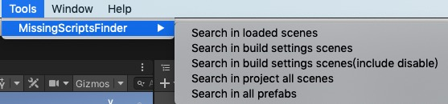
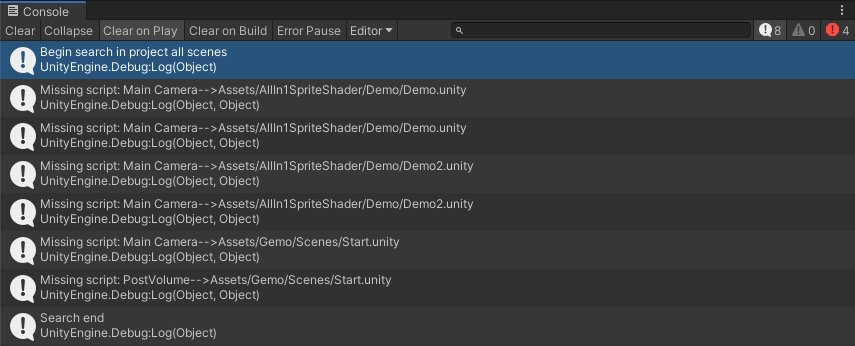
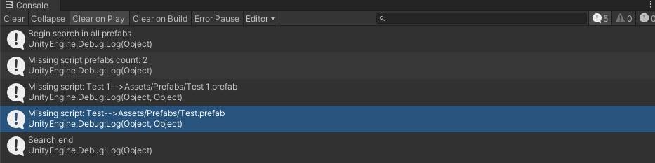
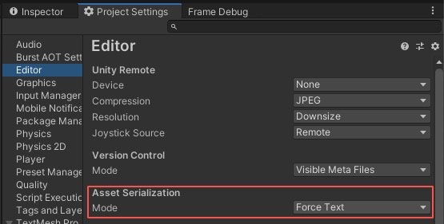

# MissingScriptsFinder
Find all missing script reference gameObjects in unity project, include scenes and prefabs.

## Features
* It's very fast!
* Find in scenes and prefabs.
* Show missing script reference gameObjects full path in log console(include scene path or prefab path if need).
* Click console item will auto select gameObject or scene or prefab.

## Usage
* Click the menu item "Tools/MissingScriptsFinder/" and choose on sub item to begin search.

* Any Missing script gameObject found will be shown in log console.

* Click console item to select gameObject or scene or prefab.

## Notice
In order to use this script, you have to set Asset Serialization Mode to Force Text.

